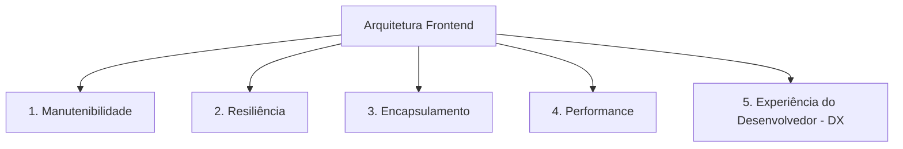

# 🏛️ Visão Geral de Arquitetura Frontend

> 🌐 **Idioma Padrão:** **Português (Brasil)**

---

## 1. Princípios Fundamentais de Engenharia

Nossas aplicações frontend são construídas seguindo 5 pilares fundamentais que garantem longevidade do produto e alta produtividade do time:



### 1. Manutenibilidade e Baixo Acoplamento
* O código deve ser modular. Modificações em uma funcionalidade ou domínio não devem provocar efeitos colaterais indesejados em outras áreas da aplicação.
* Evitamos dependências diretas de bibliotecas externas espalhadas em UI componentes; encapsulamos integrações de terceiros atrás de abstrações e adaptadores (*Adapter Pattern*).

### 2. Resiliência e Fail-Safe
* A interface do usuário não deve quebrar inteiramente por conta de uma falha em uma API secundária ou serviço de terceiros.
* Adotamos estratégias de *Error Boundaries*, tratamentos de exceção padronizados e fallbacks seguros para todas as chamadas assíncronas e chaves de controle (Feature Flags).

### 3. Encapsulamento de Regras de Negócio
* Componentes visuais (`JSX/TSX`) devem ser primariamente declarativos e focados em apresentação (*Presentational Components*).
* A lógica de estado, transformações de dados e chamadas HTTP devem residir em Hooks customizados, serviços de infraestrutura ou gerenciadores de estado dedicados.

### 4. Performance por Padrão (*Performance by Default*)
* Toda nova funcionalidade deve levar em consideração o impacto na carga inicial (*bundle size*) e na interatividade do usuário (Core Web Vitals).

### 5. Idioma e Padronização
* Toda a documentação, comentários e guias de contribuição devem manter o **Português (Brasil)** como padrão, garantindo alinhamento e clareza entre todos os engenheiros.

---

## 2. Camadas da Aplicação (Clean Frontend Architecture)

```
src/
├── assets/             # Imagens, fontes e arquivos estáticos globais
├── components/         # Componentes de UI puros (Botões, Cards, Modais)
├── config/             # Configurações centralizadas (Feature Flags, Env Vars)
├── domains/            # Módulos funcionais divididos por contexto de negócio (Auth, Checkout, Dashboard)
│   └── checkout/
│       ├── components/
│       ├── hooks/
│       ├── services/
│       └── types/
├── hooks/              # Hooks React reutilizáveis compartilhados entre domínios
├── providers/          # Context Providers globais (Theme, Auth, FeatureFlags)
├── services/           # Clientes HTTP e integrações com APIs externas
└── utils/              # Funções utilitárias puras
```

---

## 3. Matriz de Guias de Arquitetura

Para consultar detalhadamente os padrões estabelecidos:

* 🚩 **Feature Flags & Governança:** Veja a [Documentação de Feature Flags](file:///Users/marcustorres/Desktop/curso-aws-com-terraform/frontend-architecture-docs/docs/feature-flags.md)
* 📋 **Template de Pull Request:** Veja o [PULL_REQUEST_TEMPLATE.md](file:///Users/marcustorres/Desktop/curso-aws-com-terraform/frontend-architecture-docs/.github/PULL_REQUEST_TEMPLATE.md)
