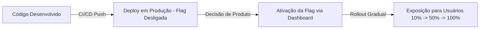

# 🚩 Documentação de Governança e Arquitetura: Feature Flags

> 🌐 **Idioma Padrão:** **Português (Brasil)**

---

## 1. Visão Geral e Objetivos

Esta documentação estabelece o padrão corporativo para a arquitetura, ciclo de vida e governança de **Feature Flags** (chaves de funcionalidade) no ecossistema das aplicações Frontend.

O objetivo principal desta estratégia é **desacoplar o Deploy da Liberação de Funcionalidades**:

* 🚀 **Deploy de Código:** Processo técnico e automatizado que ocorre diariamente via integração contínua (CI/CD).
* 🎯 **Liberação de Negócio (Rollout):** Processo estratégico em que a funcionalidade é ativada via chave de controle dinâmico, sem necessidade de nova compilação, pipeline de build ou intervenção de infraestrutura.



---

## 2. Taxonomia e Tipos de Flags

Para evitar ambiguidade quanto à finalidade de cada chave, toda Feature Flag criada na organização deve obrigatoriamente se enquadrar em uma das três categorias abaixo:

| Categoria | Sufixo Padrão | Descrição | Tempo de Vida Máximo | Responsável pela Decisão |
| :--- | :--- | :--- | :--- | :--- |
| **Release Flag** | `release_` | Liberação gradual (*canary*) de novas telas, fluxos ou integrações. | 30 dias após 100% de rollout | Product Owner / Engenharia |
| **Experiment Flag** | `experiment_` | Testes A/B e validação de hipóteses de UI/UX ou taxa de conversão. | 45 dias | Product Analytics / Design |
| **Ops Flag** | `ops_` | Botão de emergência (*Kill Switch*) para degradar ou desativar recursos sob alta carga. | Indefinido / Permanente | Engenharia de Infra / Tech Lead |

---

## 3. Padrão de Nomenclatura

Todas as chaves de flags devem seguir estritamente a convenção de caixa baixa separada por sublinhado (*snake_case*) constituída por três segmentos obrigatórios:

$$\text{Chave} = \text{[categoria]} \text{\_} \text{[dominio]} \text{\_} \text{[nome\_da\_funcionalidade]}$$

### ✅ Exemplos Válidos:
* `release_checkout_stripe_v2`
* `experiment_carrinho_botao_verde`
* `ops_relatorios_exportacao_pdf`

### ❌ Exemplos Inválidos:
* `novo_checkout` *(Inválido: Ausência de categoria e domínio)*
* `flag_teste` *(Inválido: Nome vago e sem propósito documentado)*
* `RELEASE-CHECKOUT` *(Inválido: Formatação incorreta, usar snake_case)*

---

## 4. Diretrizes de Arquitetura de Código

### A. Tipagem Centralizada (*Single Source of Truth*)
Nenhuma string de flag deve ser utilizada de forma solta no código (*magic strings*). Todas as chaves devem ser registradas em um `enum` ou `type` estritamente tipado no Frontend.

```typescript
// src/config/feature-flags.ts

export enum FeatureFlags {
  RELEASE_CHECKOUT_STRIPE_V2 = 'release_checkout_stripe_v2',
  EXPERIMENT_CARRINHO_BOTAO_VERDE = 'experiment_carrinho_botao_verde',
  OPS_RELATORIOS_EXPORTACAO_PDF = 'ops_relatorios_exportacao_pdf',
}
```

---

### B. Fallback Obrigatório (*Fail-Safe*)
A aplicação deve ser resiliente a falhas de rede ou indisponibilidade da API do provedor de flags. Por isso, toda consulta deve possuir um valor padrão estático (`false` para novos recursos ou `true` para serviços críticos legados).

```typescript
// src/config/feature-flags.ts

export const DEFAULT_FLAG_VALUES: Record<FeatureFlags, boolean> = {
  [FeatureFlags.RELEASE_CHECKOUT_STRIPE_V2]: false,
  [FeatureFlags.EXPERIMENT_CARRINHO_BOTAO_VERDE]: false,
  [FeatureFlags.OPS_RELATORIOS_EXPORTACAO_PDF]: true, // Habilitado por padrão
};
```

---

### C. Consumo via Abstração (Encapsulamento)
É expressamente **proibido** acessar variáveis de ambiente (`process.env`) ou instâncias diretas de SDKs de terceiros (Unleash, LaunchDarkly, Flagsmith, etc.) dentro dos componentes de UI. O consumo deve ocorrer unicamente através dos Hooks e Providers oficiais da aplicação.

#### Exemplo de Hook React:

```typescript
// src/hooks/useFeatureFlag.ts
import { useFlags } from '../providers/FeatureFlagProvider';
import { FeatureFlags, DEFAULT_FLAG_VALUES } from '../config/feature-flags';

export const useFeatureFlag = (flagName: FeatureFlags): boolean => {
  const { flags, isLoading } = useFlags();

  if (isLoading) {
    return DEFAULT_FLAG_VALUES[flagName] ?? false;
  }

  return flags[flagName] ?? DEFAULT_FLAG_VALUES[flagName] ?? false;
};
```

#### Exemplo de Consumo no Componente React:

```tsx
// src/components/CheckoutButton.tsx
import React from 'react';
import { useFeatureFlag } from '../hooks/useFeatureFlag';
import { FeatureFlags } from '../config/feature-flags';
import { StripeCheckoutV2 } from './StripeCheckoutV2';
import { LegacyCheckout } from './LegacyCheckout';

export const CheckoutButton: React.FC = () => {
  const isStripeV2Enabled = useFeatureFlag(FeatureFlags.RELEASE_CHECKOUT_STRIPE_V2);

  if (isStripeV2Enabled) {
    return <StripeCheckoutV2 />;
  }

  return <LegacyCheckout />;
};
```

---

## 5. Ciclo de Vida e Gestão de Débito Técnico

> [!WARNING]
> **Atenção ao Acúmulo de Código Morto**
> O maior risco do uso indiscriminado de Feature Flags é o endividamento técnico decorrente de blocos `if/else` obsoletos no código-fonte.

Para evitar o endividamento técnico, o time deve seguir rigorosamente a política de **Validade Explicita**:

1. 📝 **Criação:** Toda nova flag de *Release* ou *Experiment* deve ser criada acompanhada de uma tarefa/card no Jira associada à sua remoção futura.
2. 🟢 **Rollout Total:** A flag atinge 100% dos usuários em produção.
3. 🧹 **Prazo de Limpeza:** O time de engenharia possui até **2 sprints (30 dias)** após o rollout total para remover a chave, os condicionais e todo o código legado correspondente do repositório.

---

## 6. Estratégia de Testes Automatizados

Ao testar componentes protegidos por Feature Flags, garanta que ambas as ramificações (`true` e `false`) possuam cobertura de testes.

```typescript
// src/components/__tests__/CheckoutButton.test.tsx
import { render, screen } from '@testing-library/react';
import { CheckoutButton } from '../CheckoutButton';
import { useFeatureFlag } from '../../hooks/useFeatureFlag';

jest.mock('../../hooks/useFeatureFlag');

describe('CheckoutButton Component', () => {
  it('deve renderizar StripeCheckoutV2 quando a flag estiver ativa', () => {
    (useFeatureFlag as jest.Mock).mockReturnValue(true);

    render(<CheckoutButton />);
    expect(screen.getByTestId('stripe-checkout-v2')).toBeInDocument();
  });

  it('deve renderizar LegacyCheckout quando a flag estiver inativa', () => {
    (useFeatureFlag as jest.Mock).mockReturnValue(false);

    render(<CheckoutButton />);
    expect(screen.getByTestId('legacy-checkout')).toBeInDocument();
  });
});
```
